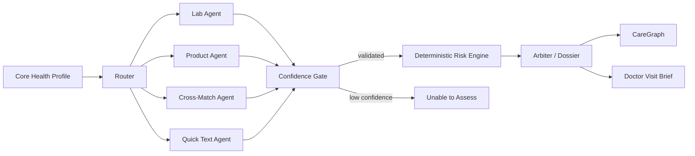

# ExtraCare AI

**Start here:** [START_HERE.md](START_HERE.md) — Windows setup/run shortcuts, API configuration and final submission steps.
### Personalized Health Intelligence & Safety Assistant

> **LLM provider in this build:** **GroqCloud (Groq, not xAI Grok)**. Chat and OCR use `qwen/qwen3.6-27b`; RAG embeddings run locally through Chroma's `all-MiniLM-L6-v2`, so Google AI Studio is no longer required.

ExtraCare AI is a real-world, multi-agent healthcare decision-support **course-project prototype**.
It connects a user's Core Health Profile with diagnostic reports, product labels, evidence, and
previous results from the current Streamlit session.

> **Core idea:** One Profile → One Intelligence Layer → Multiple Health Decisions

It is **not a medical device**, does not diagnose or prescribe, and must not be used as a substitute
for licensed clinical care.

### Problem, target users, and why AI is useful

**Target users:** adults who want help organizing and understanding the relationship between their
health context, written diagnostic reports, and everyday product labels before discussing concerns
with an appropriate clinician. The bundled demo uses synthetic data only.

**Practical problem:** the same person may receive lab/radiology text, read a food or skincare label,
and search several sources separately. That fragmentation makes it hard to see which findings are
relevant to the same health context, what changed between reports, and which questions deserve
professional follow-up.

**ExtraCare AI's role:** the system extracts structured text from uploaded documents, retrieves
profile-aware evidence, optionally searches current external information, routes the request through
specialized agents, applies deterministic safety/confidence guardrails, and produces one traceable
educational result. AI is useful here because OCR, semantic retrieval, tool use, and structured
reasoning must be combined across heterogeneous inputs rather than answered as a generic chatbot.

---

## 1. What makes ExtraCare AI different

A typical lab chatbot explains a number. A typical ingredient checker explains an ingredient.
ExtraCare AI instead asks: **what does this information mean in the user's current health context?**

The same Core Health Profile is reused across:

1. **Lab Decoder** — blood panels, urinalysis/UACR, and written radiology reports.
2. **Product Sentinel** — food, supplement/medicine ingredient labels, and skincare/cosmetic labels.
3. **Food Cross-Match** — diagnostic report + food label together.
4. **Skincare Cross-Match** — diagnostic report + cosmetic label together.
5. **Quick Ingredient Check** — fast typed-input path or label OCR.
6. **Disease Care & Protocol Hub** — general evidence-grounded disease education.
7. **My Health Timeline** — session-only activity history + CareDelta.

**Quick Ingredient Check** also has a conservative deterministic fast path: when every typed item
matches a curated local restriction rule for the relevant profile, it skips the specialist RAG/LLM
analysis call and reuses the same downstream risk/arbiter pipeline. Unknown or uncovered inputs fall
back to the normal RAG + LLM path rather than treating knowledge-base absence as proof of safety.

Shared intelligence features are reused across these modes rather than implemented as disconnected
mini-apps.

---

## 2. Signature intelligence features

### CareGraph
A deterministic relationship graph built from the structured result. It connects conditions,
medication context, and flagged findings/restrictions without making another LLM call.

Examples:

```text
Chronic Kidney Disease → dose-sensitive → Sodium
Celiac Disease → avoid → Gluten
Medication context → interaction context → Flagged finding
```

### CareDelta — “What changed?”
When the same session contains at least two lab analyses for the same health profile, ExtraCare AI
compares structured biomarkers and reports:

- increased
- decreased
- unchanged
- changed qualitative values
- numeric percentage change when calculable

CareDelta intentionally reports **direction**, not “clinically better/worse,” because that depends on
the biomarker and clinical context.

### Evidence provenance
Clinical-view flags expose deterministic/RAG/AI provenance. Live-search use is tracked at the
analysis/protocol level rather than being stamped onto every flag when the search result did not
directly support that finding.

- 🧮 deterministic calculation
- 📚 RAG evidence
- 🤖 AI synthesis
- 🌐 live search (global execution/protocol provenance when actually used)

### Confidence Gate
A hazard score answers “how concerning are the validated findings?” The Confidence Gate answers the
more important first question: **“Do we have enough trustworthy input to show a verdict at all?”**

Examples that fail closed:

- no readable lab values/findings
- no product ingredient list
- unparseable model JSON
- visibly incomplete/unclear OCR signals

Truncated documents and explicit unreadability signals are blocked. Empty structured rows are not usable input.
A low-confidence input shows **Unable to assess safely** instead of becoming 100/100 Safe.
Explicit age/gender contradictions between a printed report and the entered profile are also blocked
before personalized interpretation.

### CareSwap
When a product has caution/danger findings, the final dossier suggests safer **selection criteria**
(e.g. lower-sodium, fragrance-free, simpler formulation) rather than asserting that a particular
commercial product is medically safe.

### Patient View + Clinical View
The same analysis supports two presentations:

- **Patient View:** concise explanation and actionable next steps.
- **Clinical View:** extracted structured data, evidence tags, sources, uncertainty, and specialist
  routing.

No extra model call is needed to switch views.

### Doctor Visit Brief
Each successful result can generate a downloadable Markdown handoff containing:

- health profile
- current findings
- confidence
- relevant trends when available
- suggested clinical department(s)
- questions to discuss with a clinician

### Session-only Personal Health Memory
ExtraCare AI remembers recent checks and lab extractions only in the current Streamlit session by
default. The user can clear this memory and cached analyses from the Timeline page.

---

## 3. Safety-oriented clinical features

### 3.1 Graduated restriction classification

A product finding can carry one or more **condition-specific** rules.

#### Fully Restricted
Used only where supplied evidence supports complete avoidance / an absolute contraindication.

#### Partially Restricted
Used where risk depends on dose, concentration, total exposure, frequency, disease stage, or other
context.

Each restriction supports:

```text
condition
classification
mechanism
tolerated_dose
danger_threshold
observed_amount
threshold_status
source
```

### 3.2 Fake-precision guard

ExtraCare AI follows this rule:

> **No verified evidence → no numeric threshold.**

The agent is instructed not to invent doses or cutoffs, and `analysis_utils.py` performs a second,
code-level check: a numeric restriction threshold is removed unless the complete threshold phrase appears in a retrieved chunk carrying the cited source. This is a conservative
textual guard, not clinical validation of the claim.

Live search is useful for current recalls/status context, but it is deliberately **not trusted as the
sole authority for a clinical dose threshold**. A small bundled source-label allowlist also prevents
illustrative/general references from driving high-stakes numeric thresholds or absolute restrictions.

### 3.3 Diagnostic modalities

`Lab Decoder` supports structured extraction from:

- CBC / blood panels
- metabolic, renal and liver panels
- glucose/HbA1c/lipids/endocrine panels
- urinalysis dipstick
- microscopic urinalysis
- UACR / urine albumin-to-creatinine ratio
- written X-Ray reports
- written Ultrasound reports
- written MRI reports
- written CT reports

Radiology input must be the **written Findings / Impression report**, not raw DICOM films.

### 3.4 Qualitative urinalysis

`Biomarker` supports both numeric and qualitative values, so the OCR schema can represent:

```text
Protein: Trace / 2+
Blood: Negative / Trace
Bacteria: Few
RBC: 8–10 /HPF
UACR: 145 mg/g
```

### 3.5 Adult eGFR guard

The CKD-EPI 2021 eGFR calculation remains deterministic, but this prototype does **not** apply it for:

- age under 18
- pregnancy
- missing/incompatible creatinine units, urine specimens, inequalities, or non-positive values

This avoids applying the adult mg/dL equation outside the assumptions encoded in this project.

### 3.6 Product type and exposure-route guard

Food and Skincare Cross-Match validate the OCR-inferred product type. Oral/dietary restrictions are
not automatically transferred to topical exposure, and a claimed observed quantity is removed when
that number is not visible in the extracted label.

### 3.7 Interaction concern vs underlying report attention

Cross-Match deliberately separates the heuristic **product–report interaction concern** from the
**underlying report attention** level. A low-interaction product cannot make a severely abnormal
report appear low-risk overall.

### 3.8 Specialist / department engine

Caution/danger findings are mapped deterministically to up to three relevant departments, including:

- Nephrology
- Endocrinology
- Cardiology
- Hepatology / Gastroenterology
- Hematology
- Pulmonology
- Orthopedics
- Rheumatology
- Urology
- Dermatology
- Obstetrics / Gynecology
- Allergy & Immunology

Danger findings are considered before caution findings.

---

## 4. AI + agent workflow



### Product fast path

```text
Product OCR
   ↓
   ├── Toxicology RAG ──┐
   └── Live Web Search ─┤  (parallel)
                       ↓
                 Product Agent
                       ↓
                Confidence Gate
                       ↓
             Risk Engine → Arbiter
```

### Cross-Match fast path

```text
Lab OCR ─────┐
             ├─ parallel OCR
Product OCR ─┘
      ↓
Clinical RAG ──┐
Toxicology RAG ┤  parallel retrieval
               ↓
        Cross-Match Agent
               ↓
        Confidence Gate
               ↓
      Risk Engine → Arbiter
```

---

## 5. RAG and vector database

ExtraCare AI uses:

- **ChromaDB** for vector storage
- **local all-MiniLM-L6-v2 embeddings** for semantic embeddings
- separate clinical and toxicology collections
- profile-aware retrieval queries
- adaptive retrieval depth for long ingredient lists

The bundled knowledge base is small and intended for demonstrating architecture. It must be replaced
or expanded with formally validated, maintained clinical sources before any real-world medical use.

### Knowledge-base document strategy

The source JSON is already structured at fact-record granularity, so one curated record becomes one
semantic document. The app does not arbitrarily split a short guideline fact into fixed-token chunks.

---

## 6. OCR and multi-page PDF handling

Images are normalized locally to compact JPEGs before multimodal OCR. PDFs are rendered page-by-page and sent in one Groq vision request, up to `MAX_PDF_PAGES` (default `3`). The three-page default matches the configured Qwen vision model's current image-input limit; longer PDFs are marked as truncated so the UI cannot silently imply full-document coverage.

The UI preview shows the first page; the OCR pipeline can process multiple pages.

---

## 7. Search grounding

Tavily is used as the external search-grounding mechanism.

Current uses include:

- product recall / ban / safety-alert search
- supplementary disease-guideline discovery

The app degrades gracefully when `TAVILY_API_KEY` is not configured.

---

## 8. LangSmith tracing

Important executions are decorated with LangSmith tracing, including agents, OCR, retrieval, search,
and deterministic risk calculation. LangGraph adds workflow visibility on top.

For the final submission, capture traces that demonstrate at least:

1. **Lab Decoder:** Router → OCR → RAG → Lab Agent → Confidence → Risk → Arbiter
2. **Product Sentinel:** Router → OCR → RAG + Tavily → Product Agent → Confidence → Risk → Arbiter
3. **Cross-Match:** parallel OCR → parallel retrieval → Cross-Match → Risk → Arbiter

After live synthetic validation, `scripts/export_langsmith_traces.py` locates the latest three root
workflow traces. It is read-only by default. Use `--share --update-submission-links` only after
inspecting the traces and confirming that they contain synthetic demo data only.

---

## 9. Project structure

```text
ExtraCare-AI/
├── backend/
│   ├── controllers/       # frontend/backend boundary
│   ├── agents/            # specialized LLM/agent responsibilities
│   ├── core/
│   │   ├── safety/        # fail-closed deterministic guardrails
│   │   ├── care_delta.py
│   │   ├── care_graph.py
│   │   ├── doctor_brief.py
│   │   ├── egfr.py
│   │   ├── risk_engine.py
│   │   └── specialist_map.py
│   ├── models/schemas.py  # Pydantic data contracts
│   ├── rag/               # Chroma + local all-MiniLM-L6-v2 embeddings + retrieval
│   ├── tools/             # OCR, PDF, search
│   └── workflow/graph.py  # LangGraph orchestration
├── frontend/
│   ├── app.py
│   ├── ui_common.py       # rendering/session state/controller calls only
│   ├── assets/style.css   # all UI styling
│   └── pages/
├── data/
│   ├── knowledge_base/
│   │   └── source_registry.json
│   └── sample_images/
├── docs/
│   ├── CLINICAL_SAFETY.md
│   ├── CONTRIBUTION.md
│   ├── DEMO_SCRIPT.md
│   ├── DEPENDENCIES.md
│   ├── LIVE_VALIDATION.md
│   └── RUBRIC_COMPLIANCE.md
├── scripts/
│   ├── preflight.py
│   ├── validate_live.py
│   ├── export_langsmith_traces.py
│   └── run_submission_checks.py
├── tests/test_core.py
├── requirements.txt
├── requirements.lock
├── pyproject.toml
├── .env.example
└── SUBMISSION_CHECKLIST.md
```

The frontend does not directly call Groq, Tavily, Chroma, LangGraph, or clinical algorithms; it
uses `backend/controllers/` as the application boundary.

---

## 9.1 Runtime and performance choices

- **Streamlit remains the frontend**: replacing it with a separate HTML/React frontend would not materially reduce the main latency, which comes from OCR/model calls, embeddings, and optional live search.
- **External CSS only**: all custom styling lives in `frontend/assets/style.css`; frontend Python contains class-based markup but no inline CSS rules.
- **Groq defaults**: `qwen/qwen3.6-27b` for chat and multimodal OCR with hidden/non-thinking JSON output by default, plus local Chroma `all-MiniLM-L6-v2` embeddings for RAG.
- **Fast mode** skips Tavily and the extra narrative Arbiter call, reuses structured output for CareGraph/CareDelta/Doctor Brief, and uses profile-aware session caching.
- **Chroma clients and embeddings are reused** within the Python process to avoid repeated initialization overhead.

## 10. Setup

Recommended one-command setup (Python 3.11–3.13; Python 3.12 recommended):

```bash
python scripts/project.py setup
```

On Windows, the Python launcher form is also convenient:

```powershell
py scripts/project.py setup
```

This creates `.venv`, installs `requirements.txt`, preserves an existing `.env`, and creates a
placeholder `.env` from `.env.example` only when one does not exist. Add your own keys locally, then:

```bash
python scripts/project.py check
python scripts/project.py run
```

Manual virtual-environment setup remains possible if preferred; see [START_HERE.md](START_HERE.md).

### Environment variables

| Variable | Required | Purpose |
|---|---:|---|
| `GROQ_API_KEY` | Yes | Groq chat + multimodal OCR |
| `TAVILY_API_KEY` | Submission | live search grounding required for the final search demo |
| `LANGSMITH_TRACING` | Submission | LangSmith tracing (`true` only for final synthetic trace capture) |
| `LANGSMITH_API_KEY` | Submission | LangSmith authentication |
| `LANGSMITH_PROJECT` | Submission | trace project name |
| `CHAT_MODEL_NAME` | Optional | text-analysis model override |
| `VISION_MODEL_NAME` | Optional | OCR/vision model override |
| `EMBEDDING_MODEL_NAME` | Optional | embedding model override |
| `MAX_OUTPUT_TOKENS` | Optional | model response limit |
| `GROQ_TIMEOUT_SECONDS` | Optional | model request timeout (default 60s) |
| `GROQ_REASONING_EFFORT` | Optional | Qwen reasoning mode; default `none`, use `default` to enable model reasoning |
| `MAX_PDF_PAGES` | Optional | max pages rendered for one OCR call |

No API keys belong in GitHub. `.env` is ignored and `.env.example` contains placeholders only. Legacy `LANGCHAIN_*` LangSmith environment names are accepted by the code for compatibility.

---

## 11. Testing

Run the core regression suite:

```bash
python -m pytest -q
```

Or run the local pre-demo preflight (dependency check + core tests + all offline tests and LangGraph compile; no API calls):

```bash
python scripts/preflight.py
```

The full audit suite contains **110 tests**, including the original 40 core checks, new regression
cases, real Chroma/LangGraph integration with controlled external responses, and Streamlit AppTest flows.
Run `python -m pytest -q` for the complete suite. The original core suite covers:

- profile schema
- qualitative urinalysis
- graduated restrictions
- age/Gender-dependent eGFR behavior
- eGFR pregnancy and under-18 guard
- eGFR incompatible-unit guard
- Groq JSON extraction regressions
- confidence fail-closed behavior
- deterministic hazard scoring
- real multi-page PDF rendering
- multi-specialist routing
- UACR → Nephrology pathway keywords
- hepatomegaly / orthopedics routing examples
- CareDelta numeric and qualitative comparison
- CareGraph relationship generation
- adaptive RAG retrieval depth
- condition-to-KB coverage
- explicit UACR knowledge-base backing
- deterministic Quick Check fast-path + safe fallback behavior
- malformed-analysis fail-closed behavior and numeric-threshold sanitizer
- explicit report/profile demographic mismatch blocking
- food vs skincare product-type gating
- topical-vs-oral exposure-route guard
- generic condition warnings not becoming personalized danger
- underlying clinical-attention separation
- observed label-quantity verification
- CareDelta unit mismatch refusal
- high-stakes source registry behavior
- Disease Hub unsupported-precision stripping

See `docs/VALIDATION.md` for the manual/live-API test matrix.

---

## 12. Demo path for judges

A concise demonstration can show technical depth without clicking every page.

### Demo 1 — Lab + CareDelta

1. Set a profile.
2. Analyze **Sample blood panel**.
3. Analyze **Sample follow-up panel**.
4. Show:
   - structured OCR
   - eGFR (when applicable)
   - Confidence Gate
   - CareDelta
   - specialist routing
   - CareGraph
   - Doctor Visit Brief

### Demo 2 — Product Sentinel

1. Use a relevant condition profile.
2. Upload sample food/skincare label.
3. Show:
   - OCR
   - RAG
   - Tavily trace (if configured)
   - complete-avoidance vs dose-dependent restriction
   - Evidence Tags
   - CareSwap

### Demo 3 — Written radiology report

Use **Sample radiology report** and show that the app extracts the written findings/impression rather
than pretending to interpret raw DICOM imaging.

---

## 13. Important limitations

- The bundled knowledge base is a **course-demo dataset**, not a comprehensive clinical database.
  A high-stakes source registry limits what bundled entries may drive numeric thresholds or absolute restrictions.
- Some legacy entries are explicitly marked as not independently re-verified against primary
  guidelines.
- Medication names are included as context but ExtraCare AI is **not a validated drug-interaction
  checker** and does not contain a comprehensive drug database.
- Product search is supplementary; search results can be incomplete or noisy.
- The deterministic compatibility score is a **heuristic**, not a probability of toxicity,
  hospitalization, disease, or adverse event.
- Radiology support is for the **written report only**.
- CareDelta reports change direction; it does not decide that every increase/decrease is beneficial
  or harmful.
- Session-only memory is intentionally non-persistent in this prototype.
- Live Groq/Tavily/LangSmith behavior must be tested with the submitter's own API keys before the
  recorded demo.

---

## 14. Academic presentation framing

The safest and most defensible description is:

> **ExtraCare AI is an educational personalized health decision-support prototype demonstrating
> multimodal OCR, RAG, vector search, live search grounding, multi-agent workflows, deterministic
> calculations, confidence gating, and traceability. It is not a validated medical device.**

That framing accurately matches what the code implements.

## 15. Final verification before submission

The repository includes regression tests, static checks, synthetic sample inputs, and a rubric map.
Before recording or submitting, reproduce the local checks on the actual demo machine:

```bash
python scripts/verify_offline_outputs.py
python scripts/preflight.py --submission
```

Then enter your own provider keys in the ignored `.env`, enable LangSmith tracing, and run the
synthetic live validation:

```bash
python scripts/validate_live.py
python scripts/export_langsmith_traces.py
```

Inspect the three synthetic root traces in LangSmith. Only after confirming that they contain no
private patient data should you intentionally create evaluator-accessible links:

```bash
python scripts/export_langsmith_traces.py --share --update-submission-links
```

Finally, open the application in a browser, compare OCR output with the bundled synthetic sample
images, verify every submitted link, and add your actual GitHub and English presentation URLs to
[SUBMISSION_LINKS.md](SUBMISSION_LINKS.md). The source-label registry is a conservative allowlist;
it does not independently validate every clinical statement in the small educational knowledge base.
